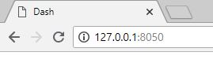

# Dash-DAQ-Robotic-Arm-Edge

## Introduction
An application that allows the user to control an robotic arm known as the [Robotic Arm Edge](https://www.adafruit.com/product/548). [Play with the app here](https://dash-daq-robotic-arm-edge.herokuapp.com/) and learn more about this application from our [blog entry](https://www.dashdaq.io/sparki). //Add link to blog post.


### Robotic Arm Edge
This robot arm is a nice hobby project for anyone who loves electronics. It is controlled by multiple stepper motors, allowing it to rotate left and right, and of course move forwards and backwards. It also includes, and LED light, located near the grippers. In order to use this application you will need the [USB interface component](https://www.robotshop.com/ca/en/owi-usb-interface-for-robotic-arm-edge.html). Robotic arms are used in industry, and manufacturing all over the world. They have a huge variety of application.


### dash-daq
[Dash DAQ](http://dash-daq.netlify.com/#about) is a data acquisition and control package built on top of Plotly's [Dash](https://plot.ly/products/dash/). It gives users more accesibility and, key features for data aquistion applications.


## Requirements
It is advisable	to create a separate conda environment running Python 3 for the app and install all of the required packages there. To do so, run (any version of Python 3 will work):

```
conda create -n	[your environment name] python=3.6.4
```
```
source activate [your environment name]
```

To install all of the required packages to this conda environment, simply run:

```
pip install -r requirements.txt

```

and all of the required `pip` packages, as well as the package, will be installed, and the app will be able to run.
 
## How to use the app
If you are running Windows 10, you will have a lot of trouble with the drivers. Follow the instructions at the [bottom of this page](https://github.com/artmg/MuGammaPi/wiki/Robotic-Arm) titled **Windows** to install working drivers for this app, and the required **roboarm** library.

There are two versions of this application. A mock version for the user to play with, without any instruments connected, and a local version, that can be connected to a device.

### Local Application
If you would like to run the **local version**, please connect the **USB interface** of the Robotic Arm Edge to the USB port on your computer, and run in the command line:

``` 
python app.py
```


and you should see this:


Open the web address given to you in your browser and the application will be ready for use:



If the app is run, but the device is not connected you will see something like this:


### Mock Application
If you would like to run the **mock version**, run in the command line:

```
python app_mock.py 
```


and you should see this:


Open the web address given to you in your browser and the application will be ready for use:


### Controls
* Left Joystick: Moves base left and right. Turns LED on and off.
* Read Me: Displays read me.
* Top Right Joystick: Moves wrist up and down. Opens and closes grippers.
* Bottom Right Joystick: Moves elbow up and down. Moves shoulder up and down.

## Resources
The RoboArm library was used to control the Robotic Arm Edge. The API can be found [here](https://github.com/nvbn/roboarm).

